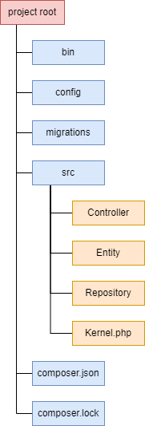
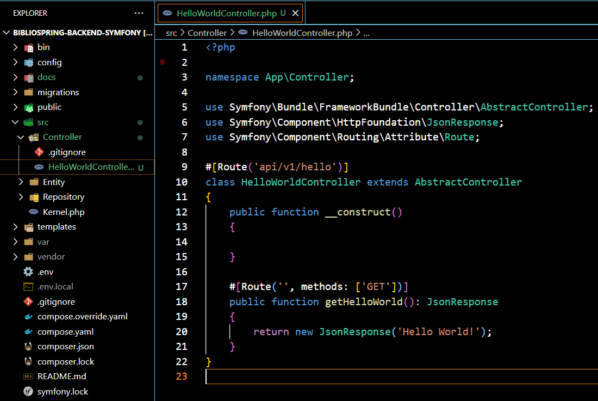

# Build rendszerek szükségessége

src/hello/hello-world.php:
```php
<?php

echo "Hello World";
```


PHP szkript futtatása:

```bash
php src/hello/hello-world.php
```

A PHP egy interpretált (értelmezett) nyelv ellenben a Java nyelvvel, ami kompilállt (fordított). A PHP szkripteket a PHP motor értelmezi, ami a Zend Engine, majd belsőleg lefordítja és futtatja ezeket. A felhasználó nem végez semmilyen kompilálást közvetlen módon.

A PHP szkripteket egy web szerveren keresztül is lehet futtatni, ha ez a szkript a web szerver gyökér könyvtárában található (`public_html` vagy `htdocs`). Ekkor, ha meghívjuk a böngészőből az útvonalat, ami `http://localhost/hello-world.php`, akkor láthatjuk a visszakapott üzenetet a böngészőben.

# Build és függőségkezelési eszközök

PHP függőségkezelő rendszer: `Composer`

A Composer maga is PHP nyelvben íródott.

Closure - lambda kifejezés PHP-ban:

```php
<?php
$c1 = function() {
    printf("Hello from closure");
};

$c2 = function($param) {
    printf("Hello from closure, param = $param");
};

$c1();
$c2(42)
```

 - A Composer nyílt forráskódú: https://github.com/composer/composer
 - Képes több projekt függőségeit kezelni, azonban nem ajánlott és minden projektnek külön `composer.json` file készítése az elvárt
 - Nem diktál konvenciót a folderek és állományok elhelyezésére, nevére és struktúrájára a projekten belül.
 - A Composerben a pluginok maga a csomagok, amiket telepíthetünk vagy saját magunk írhatunk.
 - Deszkriptor: `composer.json` (JSON formátum) és `composer.lock`
 - Célpont mappa: nincs
 - Csak PHP projektekhez

A PHP nem követel előre meghatározott projekt struktúrát. A fejlesztőre van bízva, hogy hogyan építi fel a projektet és hova helyezi el a foldereket és file-okat. Azonban PHP frameworkok már előre definiált projekt struktúrával dologznak és ajánlanak. A `composer.json` mindig a projekt gyökér könyvtárában kell legyen.

A `Composer` nem rendelkezik semmilyen task-kal vagy pluginnal a `Gradle`-lel szemben, csak más függőségek és csomagok telepítését teszi lehetővé.

Symfony által javasolt struktúra egy új projekt esetén:



 - **bin** - olyan PHP scriptek, amelyeket nem a projekt futása közben hívunk meg
 - **config** - config file-ok, Symfony bundle-ok (*.yaml, *.php) az app konfigurálásához, pl. route-okat tartalmazó Controllerek útvonala, Service-ek útvonala, automatikus autowiring engedélyezése stb.
 - **migrations** - adatbázis migrációs szkriptek
 - **src** - applikáció működésének forráskódja Controllerekkel, Entityk, Repositoryk és minden egyéb szükséges kódnak itt van a helye, mint a Service-ek, Utils stb.
 - **composer.json** - projekt leíró file az általunk telepített függőségek és verziók listájával, illetve egyéb configok
 - **composer.lock** - az összes függőség listája a pontos verzióval
 - **tests** - szintén a gyökér könyvtárban szerepel az applikációhoz megírt tesztekkel, amelyek lehetnek Application, Integration vagy Unit tesztek

# Symfony projekt példa



# Függőségek és tárolók

A függőségek a projekt gyökér könyvtárában levő `vendor` könyvtár alatt találhatók, ha ezek már telepítve vannak a `Composer` által

Ha nincsenek telepítve, akkor alapértelmezetten a [Packagist.org](https://packagist.org/) repository az, ahol a csomagok, függőségek megtalálhatóak és ahol a `Composer` keresni fogja a kért függőségeket.

Természetesen más repositorykat is be lehet állítani a `composer.json` config file-ban:

```json
{
    "repositories": [
        {
            "type": "composer",
            "url": "https://example.org"
        }
    ]
}
```

 - **type** - a composer az alapértelmezett repository típus, amit a `Packagist.org` repository is használ. Ebben az esetben egyetlen `packages.json` file szükséges, ami tartalmazza a csomagokat/függőségeket és a `/packages.json` útvonalon érhető el. Más típus megadható, mint pl. `VCS` (Version Control System), ha egy verzió követő rendszert akarunk definiálni, mint repository (git)
 - **url** - a repository base URL

A `require` szekcióban deklaráljuk a függőségeket

```json
{
    "require": {
        "php": ">=8.2",
    }
}
```

# Példa Composer függőségre

```php
<?php

// környezeti változók biztonságos betöltése
// nincs kivétel dobás, ha nincs .env file
$dotenv = Dotenv\Dotenv::createImmutable(__DIR__);
$dotenv->safeLoad();

// most elérjük a változókat a $_ENV[] vagy $_SERVER[]
// globális változókkal
$appEnv = $_ENV['APP_ENV'];
echo $appEnv; // dev
```

# Minőségbiztosítás PHP-ban

A `PHPUnit` csomag az egyik legelterjettebb tesztelési eszköz PHP-ban, amelyet Composerrel is tudunk telepíteni : `composer require --dev phpunit/phpunit`

Ezután az `XDEBUG_MODE=coverage vendor/bin/phpunit --coverage-text --path-coverage` commanddal minden tesztet futtathatunk, ami a `tests/` könyvtárban van definiálva. Ezzel coverage-et is ellenőrzünk. Ha coverage nélkül akarjuk futtatni: `vendor/bin/phpunit`

A `phpunit.xml.dist` file-ban beállíthatjuk a generált coverage report könyvtárának relatív útvonalát:

```xml
  <coverage>
    <report>
      <html outputDirectory="build/coverage"/>
      <text outputFile="build/coverage.txt"/>
    </report>
  </coverage>
```

# Statikus kódelemzés PHP-CS-Fixerrel

Telepíthetjük Composerrel: `composer require --dev friendsofphp/php-cs-fixer`

Futtatás: `vendor/bin/php-cs-fixer fix src --diff`

Ekkor az `src` könyvtárban ellenőriz minden olyan file-t, amelyet beállítottunk neki (általában *.php) a megadott rule-ok alapján, amelyek szintén konfigurálhatóak a `.php-cs-fixer.dist.php` file-ban.
