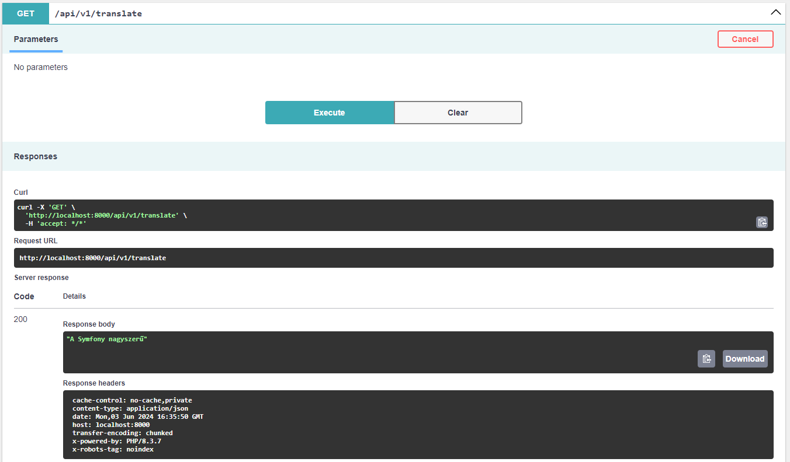

# Properties

A PHP és Symfony projekteknél .properties fájl helyett .env file-t szoktunk használni, hogy betöltsük egy környezethez tartozó változókat. Természetesen, ezt a file-t bárhogyan el lehet nevezni, azonban a .env az alapértelmezett és a legtöbb helyen ezt használják. A .env file-t kiegészítésként még társítani szokták .env.local, .env.prod stb. file-okkal, attól függően, hogy milyen környezetben akarjuk az alkalmazást futtatni. Így a .env file-t veriókövetőre is feltehetjük és a szenzitív információ csak .env.local-ba fog bekerülni, ami kimarad a verziókövetésből.

Egy környezeti változó értékét a $_ENV kulcs-érték párokat tartalmazó globális változóból kaphatjuk meg, pl.:

```php
$user = $_ENV['USER']; // user
```

Illetve új értéket is adhatunk ennek a változónak futási időben:

```php
$_ENV['USER'] = 'otherUser';
```

Figyelem. A változókat a `getenv()` függvénnyel is beolvashatjuk és `putenv()` segítségével írhatjuk felül egy változó értékét. Azonban ez már teljesen más környezeti tárolóba fog kerülni, ezért a `getenv()` visszaadja nekünk az újonnan megadott környezeti változó értékét, viszont a `$_ENV[]` ugyanarra a kulcsra még mindig a régi értéket fogja megadni nekünk, ez nem kerül felülírásra.

Állományok beolvasása a fizikai file-rendszerünkről az `fopen()` függvény segítségével valósúlhat meg. Amennyiben a file nem létezik, egy üzenetet írhatunk ki, hogy ez nem sikerült. Az `fgets()` függvény segítségével egyenként tudjuk feldolgozni a sorokat, amíg az `feof()` szól, hogy elértük a file végét.

A .env környezeti változókat tároló file-okba csak egyszerű kulcs-érték párokat tárolhatunk.

```php
<?php

$myfile = fopen("myfile.txt", "r") or die("Unable to open file!");
// Output one line until end-of-file
while(!feof($myfile)) {
  echo fgets($myfile) . PHP_EOL;
}

fclose($myfile);
```

Beépített `json` szerializáló és deszerializáló függvények PHP-ban a `json_encode` és `json_decode`. Ezeket a PHP natívan támogatja, azonban komplexebb objektumok átalakításánál lehet, hogy már valamilyen third-party library-t kell találni.

# Profilozás

PHP-ban, ahhoz, hogy több profilt állítsunk be és használjunk, valamilyen saját logikát kell implementálnunk. Például a .env file-ból beolvasni, hogy az `APP_ENV` környezeti változó `dev` vagy `prod` és ennek függvényében beolvasni a `.env.dev` vagy `.env.prod` filet.

# Nemzetköziesítés

Symfonyban a következő csomagot kell telepíteni, hogy az i18n-t be tudjuk vezetni:

```bash
composer require symfony/translation
```

Alapértelmezett érték beállítása:

```yaml
# config/packages/translation.yaml
framework:
    default_locale: hu
```

Futási időben is változtathatjuk a locale-t:

```php
use Symfony\Component\Translation\LocaleSwitcher;

class SomeService
{
    public function __construct(
        private LocaleSwitcher $localeSwitcher,
    ) {
    }

    public function someMethod(): void
    {
        // jelenlegi locale lekérése
        $currentLocale = $this->localeSwitcher->getLocale();

        // locale beállítása, ami után a teljes applikáció
        // ezt fogja használni
        $this->localeSwitcher->setLocale('fr');
    }
}
```

Az úgynevezett `MessageBundle`-okat alapértelmezetten egy `translations` könyvtár alatt tároljuk a projekt gyökér könyvtárában. Itt egy `messages.hu.yaml` file-ban megadhatjuk, hogy mi legyen egy szövegnek a magyar megfelelője.

```yaml
# translations/messages.hu.yaml
Symfony is great: A Symfony nagyszerű
```

A `Symfony\Contracts\Translation\TranslatorInterface::trans` metódussal lefordíthatjuk az angolul megadott szöveget magyarra, ha beállítottuk a locale-t és van talál ilyen nevű messages bundle-t.

```php
#[Route('api/v1/translate')]
class TranslateController extends AbstractController
{
    public function __construct(
        private readonly TranslatorInterface $translator,
        private LocaleSwitcher $localeSwitcher,
    ) {
    }

    #[Route('', methods: ['GET'])]
    public function translate(): JsonResponse
    {
        $this->localeSwitcher->setLocale('hu');
        $translated = $this->translator->trans('Symfony is great');
        return new JsonResponse($translated);
    }
}
```



## Időzóna, folyamat és pénznem

```php
...

    #[Route('/timezone', methods: ['GET'])]
    public function timezone(): JsonResponse
    {
        $this->localeSwitcher->setLocale('hu');
        $translated = $this->translator->trans('published_at', ['publication_date' => new \DateTime('2019-01-25 11:30:00')]);
        return new JsonResponse($translated); // "Publikálva ekkor: 2019. január 25., péntek - 11:30:00 UTC"
    }
    
    #[Route('/progress', methods: ['GET'])]
    public function progress(): JsonResponse
    {
        $this->localeSwitcher->setLocale('hu');
        $translated = $this->translator->trans('progress', ['progress' => 0.82]);
        return new JsonResponse($translated); // "82% a munkából kész"
    }

    #[Route('/currency', methods: ['GET'])]
    public function currency(): JsonResponse
    {
        $this->localeSwitcher->setLocale('hu');
        $translated = $this->translator->trans('value_of_object', ['value' => 9988776.65]);
        return new JsonResponse($translated); // "A műalkotás értéke mindössze 9 988 776,65 HUF"
    }
...
```

```yaml
# translations/messages+intl-icu.hu.yaml
published_at: 'Publikálva ekkor: {publication_date, date, full} - {publication_date, time, long}'

progress: '{progress, number, percent} a munkából kész'

value_of_object: 'A műalkotás értéke mindössze {value, number, currency}'
```
