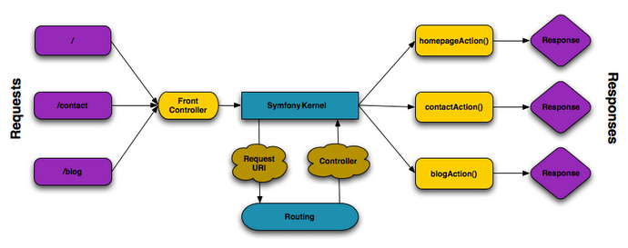

# Symfony Web

A Symfony is rendelkezik package-ekkel, hasonló módon a Spring-hez, amikkel Web alkalmazást, illetve RESTful APIt tudunk fejleszteni. Az alapvető packagek ehhez például a **symfony/framework-bundle**, **symfony/http-foundation**, **api-platform/core**.

A Symfony template motornak alapértelmezetten a **Twig**-et használja. Ez megfelel Springben például a **Thymeleaf**-nek.

Symfonyban egy úgynevezett **Front Controller** a felelős az összes bejövő HTTP kérésért. Ez indítja el a **Symfony Kernelt** ami majd megkapja a kéréseket és visszaadja a válaszokat a megfelelő Controllerektől.



Forrás: https://dev.to/brpaz/an-introduction-to-symfony--the-foundation-of-modern-php-applications-ehj

Symfonyban a bejövő kéréseket feldolgozó Controllerek egy konfigurációs fájlban vannak bejelentve. A **config/routes.yaml** tartalmazza ezeknek az útvonalukat, ezért a megfelelő Controller megkapja a megfelelő kéréseket.

```yaml
# config/routes.yaml
controllers:
    resource:
        path: ../src/Controller/
        namespace: App\Controller
    type: attribute
```

A teljes Controller is kaphat egy alapértelmezett útvonalat, amit a kérések tartalmazniuk kell, illetve a bizonyos metódusok ezt kiegészítik:

```php
# src/Controller/BookController

#[Route('/api/v1')]
class BookController extends AbstractController
{
    public function __construct(
        private readonly BookService $bookService,
    ) {
    }

    #[Route('/books', methods: 'GET')]
    public function findAll(#[MapQueryString] BookQueryParamsDto $params): JsonResponse
    {
        $response = $this->bookService->findAll($params);

        return new JsonResponse($response);
    }
}
```

A **MapQueryString** paraméter attribútummal meg tudjuk tenni, hogy a bejövő query paraméterek egyenesen egy megfelelő DTO-ra legyenek rámapelve, ha ez tartalmazza a megfelelő mezőket hozzá.

Egy másik attribútummal, **Symfony\Component\HttpKernel\Attribute\MapRequestPayload** a kérés body-jából érkező adatot tudjuk egy megfelelő DTO-ra mapelni, ami így egy teljesen típusos tükörképe lesz az adatnak.

![#[MapRequestPayload]](images/mapRequestPayload_bookCreationDto.png)

#[Route('/books/{bookId}', methods: 'GET')] útvonallal a **bookId**-t is várhatjuk mint dinamikus path paramétert.

Symfonyban általában egy **Symfony\Component\HttpFoundation\JsonResponse**
típusú választ térítünk vissza az API Controllerjeiből. Ez könnyen szerializál általunk definiált DTO osztályokat, amiket ezután visszaküld.

Megadhatunk státusz kódot, illetve headert is a visszatérített adatnak:

```php
return new JsonResponse($response, status: JsonResponse::HTTP_OK, headers: []);
```

## Hibakezelés

Ha nem találjuk ID szerint az entitást, **NotFoundHttpException** típusú kivételt dobunk, aminek **404** a státuszkódja.

```php
# GET http://localhost:8000/api/v1/books/99

#[Route('/{bookId}', methods: ['GET'])]
public function findOne(int $bookId): JsonResponse
{
    $response = $this->bookService->findOneById($bookId);
    if(!$response) {
        throw new NotFoundHttpException("Book not found with ID: $bookId");
    }

    return new JsonResponse($response);
}
```

## Erőforrás létrehozása

Sikeres hozzáadás esetén a Controller **201** státuszkódú válasszal tér vissza, vagy ha valamilyen hiba lépett fel, akkor ezt már a Service jelzi és **400**-as hibát dob.

```php
# POST http://localhost:8000/api/v1/books

#[OA\Post(
    summary: 'Új könyvet ad hozzá az adatbázishoz',
    responses: [
        new OA\Response(
            response: 201,
            description: 'Sikeres művelet',
            content: new OA\JsonContent()
        ),
        new OA\Response(
            response: 400,
            description: 'Sikertelen művelet',
            content: new OA\JsonContent()
        ),
    ]
)]
#[Route('', methods: ['POST'])]
public function create(#[MapRequestPayload] BookCreationDto $bookCreationDto)
{
    $createdId = $this->bookService->create($bookCreationDto);

    return new Response(content: "A $createdId azonosítóval rendelkező könyv létrejött.", status: Response::HTTP_CREATED);
}
```

## Erőforrás törlése

Ha nem adunk meg ID-t a kérésben, 400-as hibakód. Ha a megadott ID-jú könyv nem létezik az adatbázisban, 404-et kapunk.

Sikeres művelet esetén töröljük a könyvet és 200-at kapunk vissza egy üzenettel. Ez a kód **204 No Content** is lehet.

```php
# DELETE http://localhost:8000/api/v1/books/1

#[OA\Delete(
    summary: 'Egy könyv törlése',
    responses: [
        new OA\Response(
            response: 200,
            description: 'Könyv sikeresen törölve',
            content: new OA\JsonContent()
        ),
        new OA\Response(
            response: 400,
            description: 'Hibás kérés - Hiányzó ID',
        ),
        new OA\Response(
            response: 404,
            description: 'A könyv nem létezik a megadott ID-val',
        ),
    ]
)]
#[Route('/{bookId}', methods: ['DELETE'])]
public function deleteOne(int $bookId): JsonResponse
{
    $this->bookService->deleteOneById($bookId);

    return new JsonResponse("A $bookId azonosítójú könyv törölve.");
}
```

## A Mapper/DTO minta

Symfonyban entitások mappelését DTO-kká saját Mapperek implementálásával végezhetünk.

Egy Mapper létrehozása:

```php
# src/Mapper/BookMapper.php
<?php

namespace App\Mapper;

class BookMapper
{
    public function mapBookToBookDetailsDto(Book $book): BookDetailsDto
    {
        $bookDetailsDto = new BookDetailsDto();
        $bookDetailsDto->title = $book->getTitle();
        $bookDetailsDto->author = $book->getAuthor();
        $bookDetailsDto->isbn = $book->getIsbn();
        $bookDetailsDto->description = $book->getDescription();

        return $bookDetailsDto;
    }
}
```

Book entitás átalakítása **BookDetailsDto**-vá, amit visszatéríthetünk válaszként a felhasználónak, így elrejtve szenzitív információkat, mint például egy könyv azonosítója, ha ezt nem akarjuk feltárni. Illetve más példa egy **User** entitás esetén, amikor elrejtjük a jelszavát, mielőtt visszaküldjük a róla tárolt információkat.

Egy könyv létrehozásánál pedig a bejövő **bookCreationDto**-t alakítjuk **Book** entitássá, mielőtt megpróbálnánk elmenteni az adatbázisban:


```php
# src/Mapper/BookMapper.php
<?php

namespace App\Mapper;

class BookMapper
{
    public function mapBookCreationDtoToBook(BookCreationDto $bookCreationDto): Book
    {
        $book = new Book();
        $book->setTitle($bookCreationDto->title);
        $book->setAuthor($bookCreationDto->author);
        $book->setCreatedDate(new DateTime($bookCreationDto->createdDate));
        $book->setIsbn($bookCreationDto->isbn);
        $book->setDescription($bookCreationDto->description);

        return $book;
    }
}
```

## Entity Validation

Entitások validálásához fel tudjuk használni a **Doctrine\ORM\Mapping as ORM** osztályt, amellyel string hosszúságát, oszlop nevet, relációkat, illetve a **Doctrine\DBAL\Types\Types** osztály használatával a típust mondhatjuk meg:

```php
#[ORM\Column(length: 255)]
private ?string $name = null;

# Típus megadása
#[ORM\Column(type: Types::DATETIME_MUTABLE)]
private ?\DateTimeInterface $createdDate = null;

# ManyToMany kapcsolat a könyv és a szerző entitások között
#[ORM\ManyToMany(targetEntity: Author::class, mappedBy: 'books')]
private Collection $authors;
```

DTO-k validálásánál pedig a **Symfony\Component\Validator\Constraints as Assert** osztályt alkalmazzuk. Szintén típust, min.-max. hosszt, nullable vagy not null validációkat tudunk megadni.

```php
class BookCreationDto
{
    #[Assert\Type(type: 'string')]
    #[Assert\Length(min: 3, max: 64)]
    #[Assert\NotNull]
    public string $title;

    #[Assert\DateTime]
    #[Assert\NotNull]
    public string $createdDate;

}
```

Validációs hiba esetén **422** státusz kódú **Unprocessable Entity** kivételt kapunk, amit megfelelően le kell kezelni egy **400 Bad Request** válasszal.
